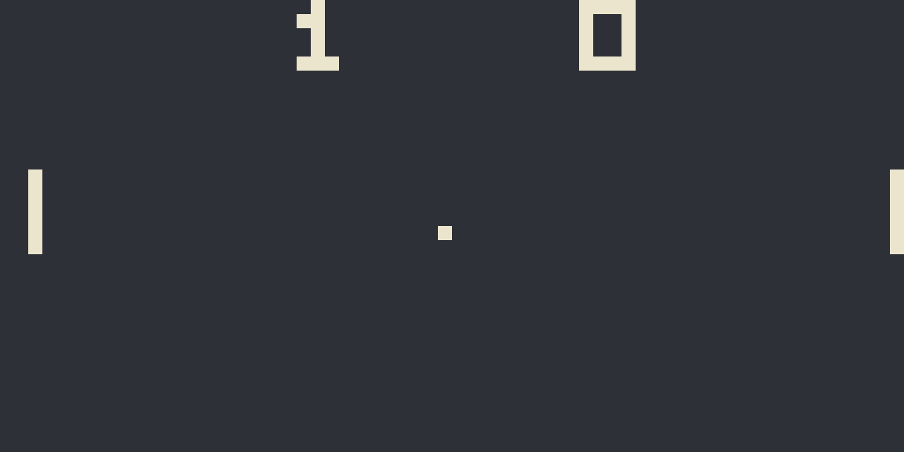
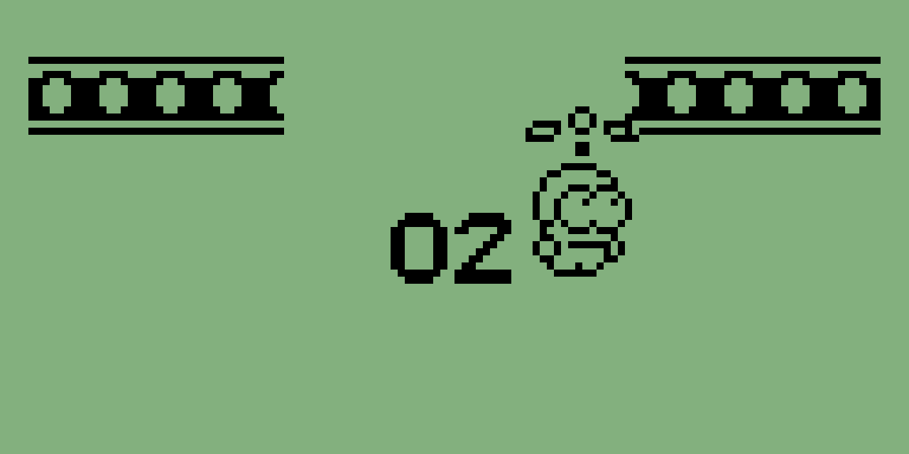
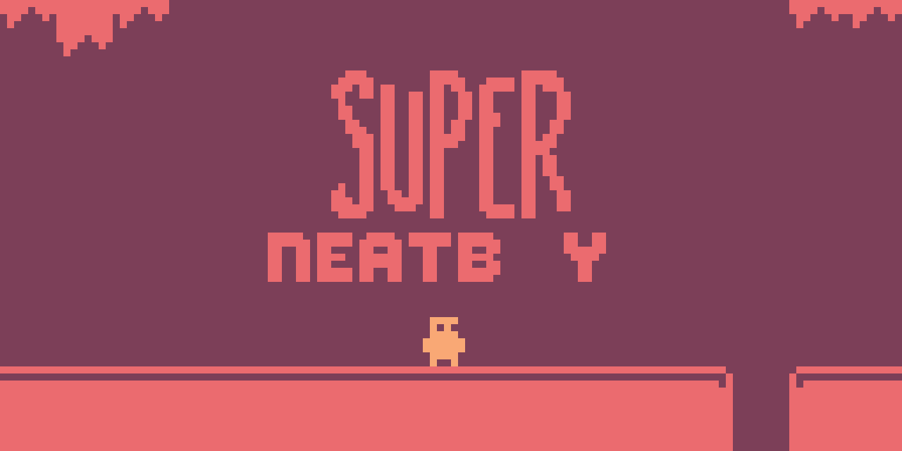

# Crisp
A CHIP-8, SUPER-CHIP, and XO-CHIP emulator written in Rust.

## Gallery
  


## Features
- Full support for CHIP-8, SUPER-CHIP, and XO-CHIP.
- XO-CHIP even has full support for an extended palette of 16 colors.
- Sound support for all variants
- Adjustable tick rate
- The ability to enable/disable quirks that are needed for some games
- CLI options to tweak the emulator according to the game you're playing
- Custom palettes that can be switched on the fly (and the ability to add your own)
- Save states to finally get the edge at PONG
- Reset/Mute buttons

## Build
- Clone the repository, then go the the `dekstop` directory and run:
```
cd crisp/desktop
cargo build
```
The executable will be in target/debug. You'll need a ROM to play, so I have included some public domain CHIP-8 games in the `c8games` directory. If you want to play PONG you can run:
```
./target/debug/desktop ../c8games/PONG
```
or just replace the `../c8games/PONG` with the ROM you want to play

## Controls
The original COSMAC VIP used the 16 hexadecimal digit keys as inputs. The keyboard is mapped to those keys as follows:

`1` `2` `3` `4` -> `1` `2` `3` `C`  
`Q` `W` `E` `R` -> `4` `5` `6` `D`  
`A` `S` `D` `F` -> `7` `8` `9` `E`  
`Z` `X` `C` `V` -> `A` `0` `B` `F`  

| Key | Action |
| ---| --- |
|`UP` |Increase tick rate by 5|
|`DOWN` |Decrease tick rate by 5|
|`RIGHT`| Pick next color theme |
|`LEFT`| Pick previous color theme |
|`M`| Mute/Unmute|
|`O`| Save state|
|`I`| Load last save state|
|`BACKSPACE`| Reset Emulator
|`ESC` | Exit |


## Options
`-v <VARIANT>` Select the emulator variant (one of: chip8, s-chip, xo-chip)

`-s <SCALE>` Set the scale multiplier [default: 15]

`-t <TICKS_PER_FRAME>` Set he number of ticks (operations) per frame [default: 10]

`-m` Start the program muted

`--fpscap-off`: Turn off capping the framerate at 60fps


The `--quirk-` options toggle the default value of the selected variant. If the quirk is by default `True` for a specific variant, it is set to `False`, and vice versa. 

`--quirk-vfreset`: The AND, OR, and XOR Opcodes (8xy1, 8xy2 and 8xy3) `reset/do not reset` the flags register to 0. 

`--quirk-memory`: The save and load opcodes (Fx55 and Fx65) `increment/do not increment` the index register.

`--quirk-displaywait` Drawing sprites to the display in low-resolution mode `waits/does not wait` for the vertical blank interrupt, limiting their speed to at most 1 draw opcode per frame.

`--quirk-clipping` Sprites drawn at the edges of the screen `get clipped/wrap around`.

`--quirk-shifting` The shift opcodes (8xy6 and 8xyE) `store the shifted version of V[y] in V[x]/only operate on V[x]`.

`--quirk-jumping` The "jump to some address plus v0" instruction (Bnnn) `use V[x] (where x is the highest nibble of nnn) instead of V[0]/only uses V[0]`.

`--quirk-clipcollision` The draw opcode (dxyn) in high-resolution mode `add to the flag register the number of rows that get clipped at the bottom edge of the screen/does not do this`. A weird quirk in the original SUPER-CHIP.


## Acknowledgements
- [Aquova's chip8-book](https://github.com/aquova/chip8-book) was my intial reference and very thorough for a complete beginner to emulation like me.
- [Timendus' chip8-test-suite](https://github.com/Timendus/chip8-test-suite) has been invaluable in debugging.
- I used [Octo](https://johnearnest.github.io/Octo/) whenever I wanted to see what games should run like in my emulator.
- [pich8](https://github.com/philw07/pich8/tree/master) was useful both as a reference for Rust emulation in general and while implementing the high resolution mode of the SUPER-CHIP
- [JAXE](https://github.com/kurtjd/jaxe/blob/main/README.md) was another resource I looked at, and basically copied their implementation of the sound driver in SDL.
- [A very thorough article of all CHIP-8 extensions](https://chip-8.github.io/extensions/).
- [John Earnest's XO-CHIP specification](https://johnearnest.github.io/Octo/docs/XO-ChipSpecification.html)
- [Gulrak's opcode table](https://chip8.gulrak.net/?p=chip8,schip11,xochip) explains the weird quirks of all CHIP-8 variants

## License
Crisp is licensed under the [MIT license](https://choosealicense.com/licenses/mit/).
